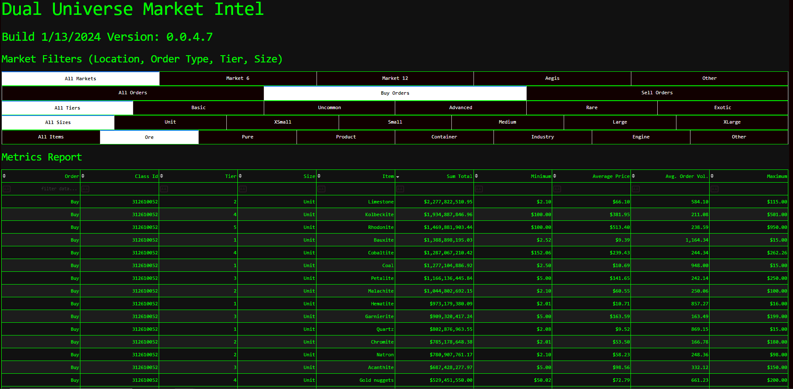
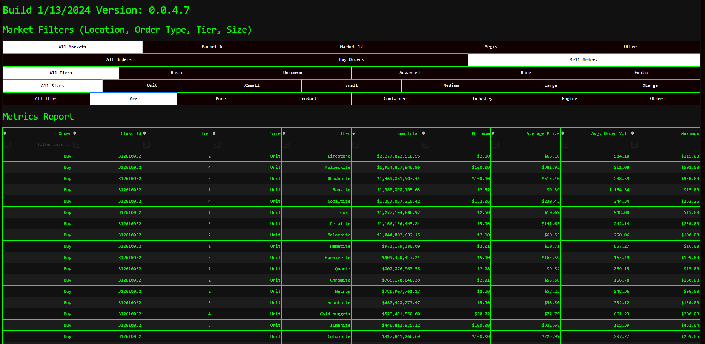

# DualMarketDash
Dual Universe Market App written with plotly framework

# Install
```
pip install dash
pip install dash-bootstrap-components
pip install concurrent-futures  # Note: This is included in Python's standard library for Python 3.2 and later
pip install plotly
pip install pandas
pip install requests
pip install pickle-mixin  # Note: 'pickle' is included in Python's standard library
```
# Usage

This program reads all of your game's log from %localappdata%\NQ\DualUniverse\log, does a bit of cleanup, then caches into market_orders.csv, then starts running a local dash app. The code is all here, we're not sending anything out, there is a fetch of some reference material.

Some of the data is weird, at least to me. NQ is afterall French, but it does appear to be somewhat optimized which means we have to use a few brain cells to understand it.

Example: buyOrderQuantity is negative for when you have placed an order. this means the value on the market is negative but this makes sense when you think from NQ's POV. They owe you ore or would credit you that value. The default app splits up buy and sell orders (could be cleaned up) but this is an example of where you'd want to split the dataset up.

### Demo: python market.py


